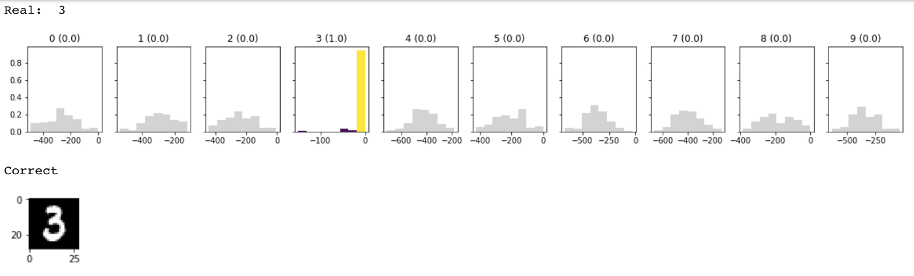
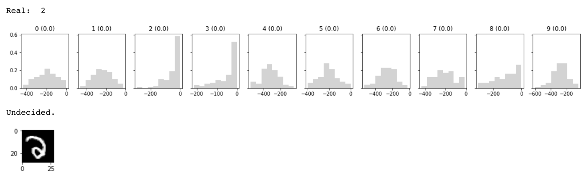
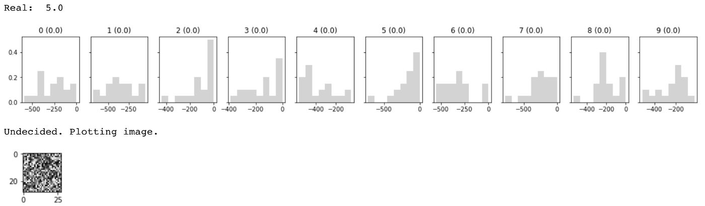
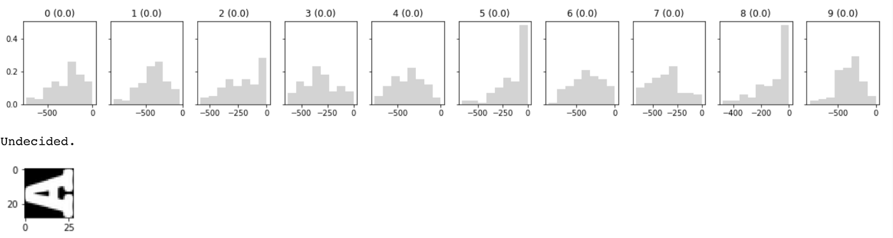

# Bayesian-Neural-Networks

Dependencies:

    PyTorch
    Pyro
    Numpy
    Matplotlib

Output example with ideal image (from handwritten digits database):

Outputs where network refuses to classify:

